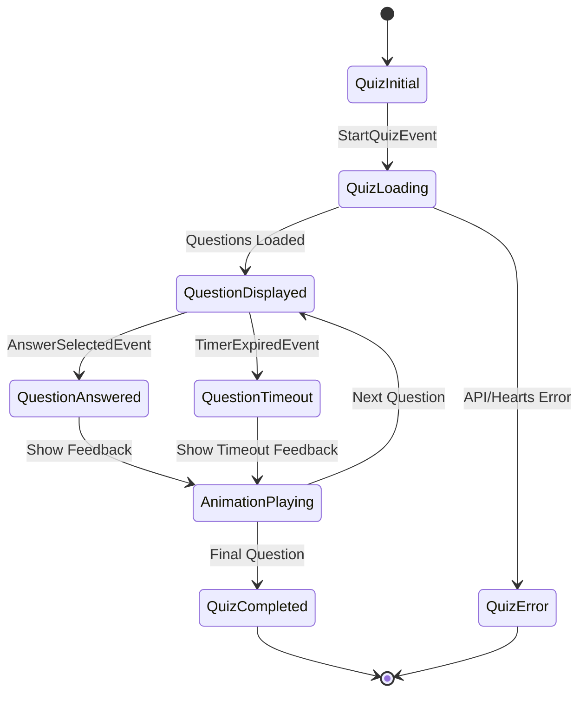

# Enhanced Quiz Engine Design

## Overview

The Enhanced Quiz Engine is built using Flutter's BLoC pattern with clean architecture principles. It manages quiz sessions through a state machine that handles question flow, timing, animations, and user interactions. The system integrates with the OpenTDB API for question sourcing, uses Hive for local caching, and provides rich multimedia feedback through Lottie animations and audio effects.

## Architecture

### Core Components

```
QuizBloc (Presentation Layer)
├── QuizRepository (Domain Interface)
├── QuestionRepository (Domain Interface)  
├── AudioService (Domain Interface)
└── AnimationService (Domain Interface)

Data Layer Implementations:
├── QuizRepositoryImpl
├── QuestionRepositoryImpl (OpenTDB + Hive)
├── AudioServiceImpl (audioplayers)
└── AnimationServiceImpl (Lottie)
```

### State Management Flow



## Components and Interfaces

### 1. QuizBloc

**Responsibility:** Orchestrates quiz session state and coordinates between services

**Key States:**
- `QuizInitial` - Ready to start
- `QuizLoading` - Fetching questions/validating hearts
- `QuestionDisplayed` - Active question with timer
- `QuestionAnswered` - Processing answer with feedback
- `AnimationPlaying` - Showing Lottie feedback
- `QuizCompleted` - Session finished
- `QuizError` - Error state with retry options

**Key Events:**
- `StartQuizEvent(category, difficulty)` - Initialize quiz session
- `AnswerSelectedEvent(answerIndex)` - User selects answer
- `TimerExpiredEvent` - Question timeout
- `AnimationCompletedEvent` - Feedback animation finished
- `NextQuestionEvent` - Proceed to next question

### 2. QuestionRepository

**Interface:**
```dart
abstract class QuestionRepository {
  Future<Either<Failure, List<Question>>> fetchQuestions({
    required int amount,
    String? category,
    String? difficulty,
  });
  
  Future<Either<Failure, List<Question>>> getCachedQuestions(int amount);
  Future<Either<Failure, void>> cacheQuestions(List<Question> questions);
  Future<int> getCachedQuestionCount();
}
```

**Implementation Details:**
- Uses Dio HTTP client for OpenTDB API calls
- Implements retry logic with exponential backoff
- Hive-based local storage for offline capability
- Question shuffling and answer randomization

### 3. AudioService

**Interface:**
```dart
abstract class AudioService {
  Future<void> playCorrectSound();
  Future<void> playIncorrectSound();
  Future<void> playTimeoutSound();
  Future<void> setMuted(bool muted);
  bool get isMuted;
}
```

**Implementation:**
- Uses `audioplayers` package for cross-platform audio
- Preloads sound files for instant playback
- Respects system and app-level mute settings
- Handles audio focus and interruptions

### 4. AnimationService

**Interface:**
```dart
abstract class AnimationService {
  Widget buildCorrectAnimation();
  Widget buildIncorrectAnimation();
  Widget buildTimeoutAnimation();
  Duration get animationDuration;
}
```

**Implementation:**
- Lottie animation widgets for visual feedback
- Consistent 3-second animation duration
- Optimized animation assets for performance
- Fallback static images if Lottie fails

### 5. HeartsService

**Interface:**
```dart
abstract class HeartsService {
  Future<int> getCurrentHearts();
  Future<Either<Failure, void>> consumeHeart();
  Stream<int> get heartsStream;
}
```

## Data Models

### Question Entity
```dart
class Question extends Equatable {
  final String id;
  final String category;
  final String difficulty;
  final String questionText;
  final String correctAnswer;
  final List<String> incorrectAnswers;
  final List<String> shuffledAnswers; // All answers in random order
  final int correctAnswerIndex; // Index of correct answer in shuffled list
}
```

### QuizSession Entity
```dart
class QuizSession extends Equatable {
  final String id;
  final List<Question> questions;
  final int currentQuestionIndex;
  final List<UserAnswer> answers;
  final DateTime startTime;
  final int heartsConsumed;
  final QuizSessionStatus status;
}
```

### UserAnswer Entity
```dart
class UserAnswer extends Equatable {
  final String questionId;
  final int selectedAnswerIndex;
  final bool isCorrect;
  final Duration timeToAnswer;
  final DateTime answeredAt;
}
```

## Error Handling

### Failure Types
- `NetworkFailure` - API connectivity issues
- `CacheFailure` - Local storage problems  
- `InsufficientHeartsFailure` - Cannot start quiz
- `AudioFailure` - Sound playback issues
- `AnimationFailure` - Lottie rendering problems

### Error Recovery Strategies
1. **Network Issues:** Fall back to cached questions
2. **Cache Issues:** Retry with exponential backoff
3. **Audio Issues:** Continue without sound, show visual indicator
4. **Animation Issues:** Use static feedback images
5. **Hearts Issues:** Redirect to hearts acquisition flow

## Testing Strategy

### Unit Tests
- QuizBloc state transitions and event handling
- Repository implementations with mocked dependencies
- Question shuffling and answer validation logic
- Timer functionality and timeout handling
- Audio service mute/unmute behavior

### Integration Tests
- Complete quiz flow from start to finish
- Network failure scenarios with cache fallback
- Hearts consumption and validation
- Animation and audio coordination
- Question caching and retrieval

### Widget Tests
- Quiz screen UI components
- Timer display and countdown
- Answer selection interactions
- Animation widget rendering
- Error state displays

## Performance Considerations

### Optimization Strategies
1. **Question Preloading:** Cache 50+ questions for smooth gameplay
2. **Audio Preloading:** Load sound files at app startup
3. **Animation Optimization:** Use optimized Lottie files (<100KB each)
4. **Memory Management:** Dispose of completed quiz sessions
5. **Network Efficiency:** Batch question requests (10-20 at a time)

### Resource Management
- Dispose audio players when not needed
- Clear animation controllers after use
- Implement proper BLoC disposal
- Use const widgets where possible
- Optimize image and animation assets