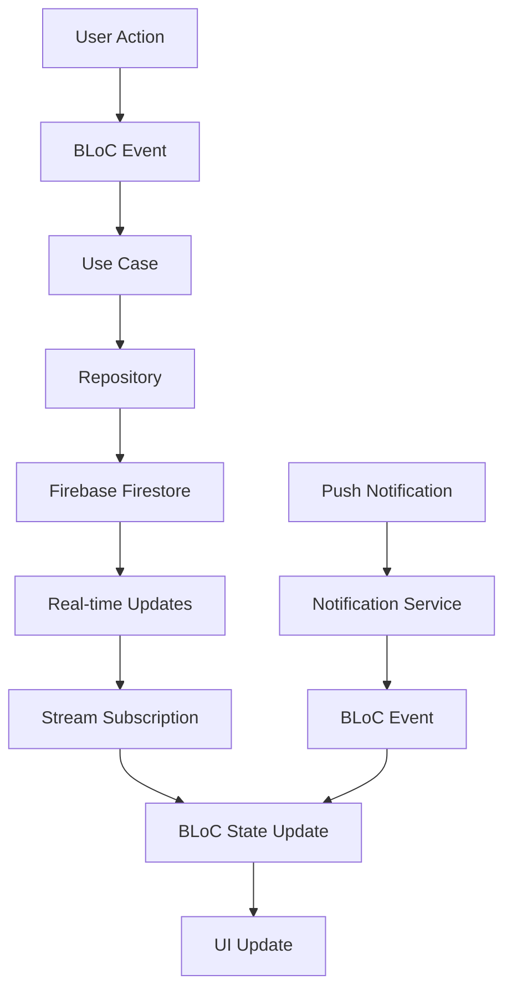

# Friends & Social Features Design

## Overview

The Friends & Social Features system is built using Flutter's BLoC pattern with Firebase backend integration for real-time social interactions. The system manages friend relationships, challenges, activity feeds, and social leaderboards while integrating with Google contacts for seamless friend discovery and invitation.

## Architecture

### Core Components

```
Social Layer (Presentation)
├── FriendsBloc (Friend management)
├── ChallengesBloc (Challenge system)
├── SocialFeedBloc (Activity feed)
└── LeaderboardBloc (Social rankings)

Domain Layer
├── FriendsRepository (Friend operations)
├── ChallengesRepository (Challenge management)
├── SocialActivityRepository (Activity tracking)
├── ContactsService (Google contacts integration)
└── NotificationService (Social notifications)

Data Layer
├── Firebase Firestore (Real-time data)
├── Firebase Cloud Messaging (Push notifications)
├── Google Contacts API (Friend discovery)
└── Local Cache (Offline support)
```

### Data Flow Architecture



## Components and Interfaces

### 1. FriendsRepository

**Interface:**
```dart
abstract class FriendsRepository {
  Stream<List<Friend>> getFriendsStream(String userId);
  Future<Either<Failure, void>> sendFriendRequest(String fromUserId, String toUserId);
  Future<Either<Failure, void>> acceptFriendRequest(String requestId);
  Future<Either<Failure, void>> declineFriendRequest(String requestId);
  Future<Either<Failure, void>> removeFriend(String userId, String friendId);
  Future<Either<Failure, List<User>>> searchUsers(String query);
  Stream<List<FriendRequest>> getFriendRequestsStream(String userId);
}
```

**Implementation Details:**
- Uses Firebase Firestore for real-time friend data
- Implements bidirectional friend relationships
- Handles friend request lifecycle management
- Provides offline caching with Hive

### 2. ChallengesRepository

**Interface:**
```dart
abstract class ChallengesRepository {
  Future<Either<Failure, Challenge>> createChallenge(CreateChallengeParams params);
  Future<Either<Failure, void>> acceptChallenge(String challengeId, String userId);
  Future<Either<Failure, void>> declineChallenge(String challengeId, String userId);
  Future<Either<Failure, void>> submitChallengeResult(String challengeId, ChallengeResult result);
  Stream<List<Challenge>> getChallengesStream(String userId);
  Future<Either<Failure, ChallengeMatch>> getChallengeDetails(String challengeId);
}
```

**Implementation Details:**
- Creates identical question sets for fair competition
- Tracks challenge states (pending, active, completed)
- Manages challenge expiration (24-hour limit)
- Stores challenge results and statistics

### 3. SocialActivityRepository

**Interface:**
```dart
abstract class SocialActivityRepository {
  Stream<List<SocialActivity>> getActivityFeedStream(String userId);
  Future<Either<Failure, void>> recordActivity(SocialActivity activity);
  Future<Either<Failure, void>> reactToActivity(String activityId, String userId, ReactionType reaction);
  Future<Either<Failure, List<SocialActivity>>> getFriendActivities(String userId, List<String> friendIds);
}
```

**Implementation Details:**
- Aggregates activities from user's friend network
- Supports activity reactions (like, congratulate)
- Implements activity privacy controls
- Provides real-time activity updates

### 4. ContactsService

**Interface:**
```dart
abstract class ContactsService {
  Future<Either<Failure, List<Contact>>> getContacts();
  Future<Either<Failure, void>> sendInvitation(Contact contact, String invitationLink);
  Future<Either<Failure, String>> generateInvitationLink(String userId);
  Future<Either<Failure, String?>> processInvitationLink(String link);
}
```

**Implementation Details:**
- Integrates with Google Contacts API
- Generates unique invitation links with user tracking
- Handles deep link processing for app installation
- Respects contact permissions and privacy

## Data Models

### Friend Entity
```dart
class Friend extends Equatable {
  final String id;
  final String userId;
  final String displayName;
  final String? photoUrl;
  final DateTime friendsSince;
  final bool isOnline;
  final DateTime lastSeen;
  final FriendshipStatus status;
  final SocialStats stats;
}
```

### Challenge Entity
```dart
class Challenge extends Equatable {
  final String id;
  final String challengerId;
  final String challengedId;
  final String category;
  final String difficulty;
  final List<Question> questions;
  final ChallengeStatus status;
  final DateTime createdAt;
  final DateTime? expiresAt;
  final ChallengeResult? challengerResult;
  final ChallengeResult? challengedResult;
}
```

### SocialActivity Entity
```dart
class SocialActivity extends Equatable {
  final String id;
  final String userId;
  final ActivityType type;
  final Map<String, dynamic> data;
  final DateTime timestamp;
  final List<ActivityReaction> reactions;
  final bool isVisible;
}
```

### FriendRequest Entity
```dart
class FriendRequest extends Equatable {
  final String id;
  final String fromUserId;
  final String toUserId;
  final String message;
  final DateTime sentAt;
  final FriendRequestStatus status;
}
```

## Real-time Features

### Firebase Firestore Structure
```
users/{userId}
├── profile: UserProfile
├── friends: Map<friendId, Friend>
├── stats: SocialStats
└── settings: PrivacySettings

friendRequests/{requestId}
├── fromUserId: string
├── toUserId: string
├── status: string
├── sentAt: timestamp
└── message: string

challenges/{challengeId}
├── challengerId: string
├── challengedId: string
├── questions: Question[]
├── status: string
├── results: Map<userId, ChallengeResult>
└── metadata: ChallengeMetadata

activities/{activityId}
├── userId: string
├── type: string
├── data: Map
├── timestamp: timestamp
├── visibility: string
└── reactions: Map<userId, ReactionType>
```

### Real-time Subscriptions
- **Friends List**: Live updates when friends come online/offline
- **Friend Requests**: Instant notifications for new requests
- **Challenges**: Real-time challenge status updates
- **Activity Feed**: Live activity stream from friends
- **Leaderboards**: Dynamic ranking updates

## Social Notifications

### Push Notification Types
1. **Friend Request Received**: "John Doe wants to be your friend"
2. **Friend Request Accepted**: "Jane Smith accepted your friend request"
3. **Challenge Received**: "Mike challenged you to a Science quiz"
4. **Challenge Completed**: "Sarah completed your challenge - check the results!"
5. **Friend Achievement**: "Alex just achieved a 10-quiz streak!"

### In-App Notifications
- Real-time badge updates for pending requests
- Toast notifications for friend activities
- Challenge completion alerts
- Achievement celebrations

## Privacy and Security

### Privacy Controls
- **Activity Visibility**: Public, Friends Only, Private
- **Online Status**: Visible, Friends Only, Hidden
- **Challenge Acceptance**: Anyone, Friends Only, Disabled
- **Contact Discovery**: Allow/Disallow friend finding via contacts

### Security Measures
- Friend request rate limiting (max 10 per hour)
- Challenge spam prevention (max 5 active challenges)
- User blocking and reporting system
- Data encryption for sensitive information

## Performance Optimizations

### Caching Strategy
1. **Friend Lists**: Cache with 5-minute TTL
2. **Activity Feed**: Cache latest 50 activities
3. **Leaderboards**: Cache with 1-hour TTL
4. **Challenge Data**: Cache active challenges locally

### Pagination
- Activity feed: 20 items per page
- Friend search results: 15 users per page
- Challenge history: 10 challenges per page

### Offline Support
- Cache friend list for offline viewing
- Queue social actions for when online
- Show cached activity feed with offline indicator
- Sync pending actions on reconnection

## Error Handling

### Network Failures
- Graceful degradation to cached data
- Retry mechanisms with exponential backoff
- User-friendly offline indicators
- Queue actions for later sync

### Social Conflicts
- Handle simultaneous friend requests
- Resolve challenge timing conflicts
- Manage duplicate activity entries
- Handle friend removal edge cases

## Testing Strategy

### Unit Tests
- Repository implementations with mocked Firebase
- Use case logic for social interactions
- BLoC state management and event handling
- Contact integration and invitation flows

### Integration Tests
- End-to-end friend request flow
- Challenge creation and completion
- Activity feed real-time updates
- Notification delivery and handling

### Social Testing
- Multi-user challenge scenarios
- Friend network activity propagation
- Privacy setting enforcement
- Concurrent social action handling